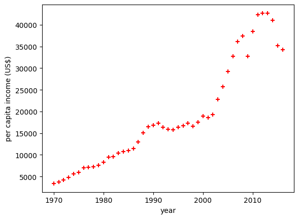
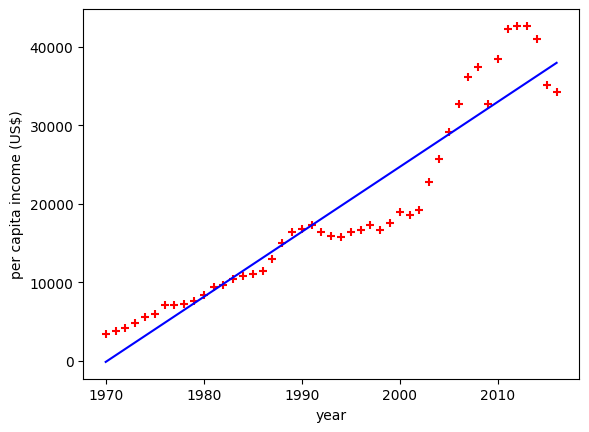

# 1. LINEAR REGRESSION

 What is Linear Regression?

Linear Regression is a statistical method used to model and analyze the relationships between a dependent (target) variable and one or more independent (predictor) variables. The primary goal is to establish a linear relationship between the variables, which can then be used for prediction or understanding the underlying patterns in the data.
Key Concepts:

Dependent Variable (Y): This is the variable we aim to predict or explain.

Independent Variable(s) (X): These are the variables used to predict the dependent variable.

Linear Equation: The relationship is modeled through a linear equation of the form:

    Y=β0+β1X1+β2X2+...+βnXn+ϵ
    Y=β0​+β1​X1​+β2​X2​+...+βn​Xn​+ϵ

        YY is the predicted value.
        β0β0​ is the y-intercept.
        
        β1,β2,...,βnβ1​,β2​,...,βn​ are the coefficients of the independent variables.
        X1,X2,...,XnX1​,X2​,...,Xn​ are the independent variables.
        ϵϵ is the error term (residuals).

Simple Linear Regression: When there is only one independent variable, the model is called simple linear regression. The equation simplifies to:
    Y=β0+β1X+ϵ
    Y=β0​+β1​X+ϵ

Multiple Linear Regression: When there are multiple independent variables, the model is called multiple linear regression.

Steps in Linear Regression:

Data Collection: Gather data that includes both the dependent and independent variables.
Data Preprocessing: Handle missing values, perform feature scaling, and split the data into training and testing sets.
Model Training: Use the training data to estimate the coefficients (ββ values) that minimize the error term (ϵϵ).
Model Evaluation: Assess the model's performance using metrics like Mean Squared Error (MSE), Root Mean Squared Error (RMSE), and R-squared (R2R2).
Prediction: Use the trained model to make predictions on new or unseen data.
---
## Exercise

Predict canada's per capita income in year 2020. There is an exercise folder here on github at same level as this notebook, download that and you will find canada_per_capita_income.csv file. Using this build a regression model and predict the per capita income fo canadian citizens in year 2020

## Answer

41288.69409442

---

## steps

### 1. import the packages
### 2. loading the data file
### 3. visualize the data in graph

### 4. fetch variables from the data for train the model of linear regression
### 5. train the model using those variable
### 6. getting the coffecient and intercept value
### 7. predict the value using the trained model
### 8. cross check the obtained value using those values {coefficient,intercept}
### 9. plot the linear line in the graph

### 10. [Exceptional]  load the predicted value in a csv

---