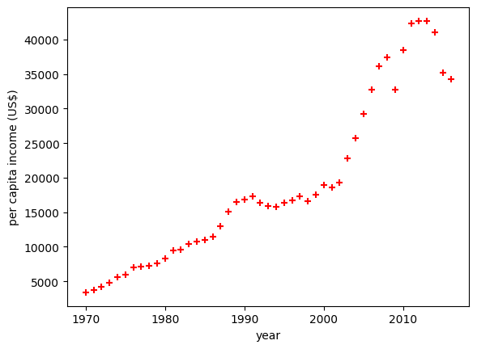
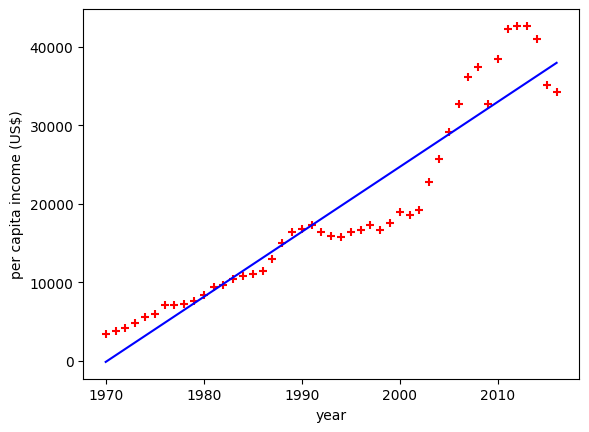

# 1. LINEAR REGRESSION

---
## Exercise

Predict canada's per capita income in year 2020. There is an exercise folder here on github at same level as this notebook, download that and you will find canada_per_capita_income.csv file. Using this build a regression model and predict the per capita income fo canadian citizens in year 2020

## Answer

41288.69409442

---

## steps

### 1. import the packages
### 2. loading the data file
### 3. visualize the data in graph

### 4. fetch variables from the data for train the model of linear regression
### 5. train the model using those variable
### 6. getting the coffecient and intercept value
### 7. predict the value using the trained model
### 8. cross check the obtained value using those values {coefficient,intercept}
### 9. plot the linear line in the graph

### 10. [Exceptional]  load the predicted value in a csv

---